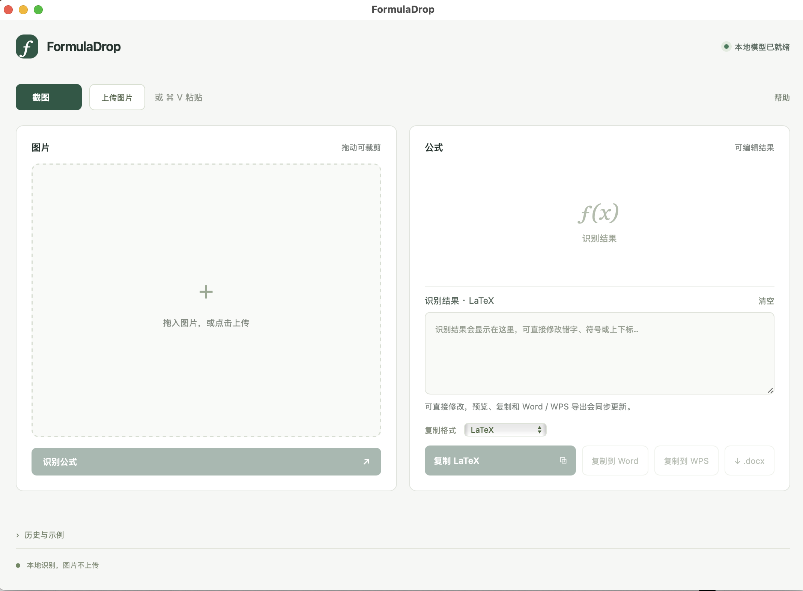
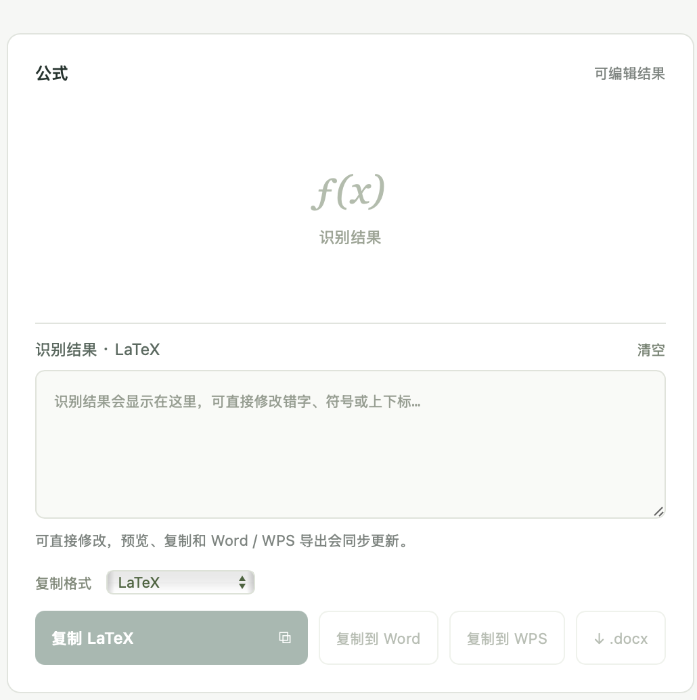

# FormulaDrop

免费的本地公式截图识别 App。鼠标拖动框选，识别为 LaTeX、MathML，或导出可编辑公式的 Word 文档。模型随下载包提供，日常识别无需联网、无需 API Key。

## 下载

[下载 macOS / Windows 版本](https://github.com/hybridIce/FormulaDrop/releases/latest)

- **macOS Apple Silicon（arm64）**：解压后将 FormulaDrop.app 拖到“应用程序”。截图需授予屏幕录制权限。应用未经过 Apple 公证，首次打开可能需要在系统设置的“隐私与安全性”中允许。
- **Windows 10/11 x64**：解压完整文件夹，运行 FormulaDrop.exe。需要 [Edge WebView2 Runtime](https://developer.microsoft.com/microsoft-edge/webview2/)；如有 DLL 加载错误，安装 [Microsoft Visual C++ x64 Runtime](https://aka.ms/vs/17/release/vc_redist.x64.exe)。Python、.NET 和模型已内置。

点击“截图”，拖动选择公式，松开鼠标即可识别；Esc 取消。也支持上传或粘贴图片。使用“复制”选择 LaTeX / MathML，或直接导出 Word 文档。首次启动会预热模型，复杂、模糊、手写公式可能识别错误，请核对结果。

## 效果图





## 从源码运行

需要 Python 3.10。

```sh
python -m venv .venv
# 激活虚拟环境后：
pip install -r requirements.txt
python prepare_models.py
python -m uvicorn app:app --host 127.0.0.1 --port 8765
```

打开 http://127.0.0.1:8765 。网页模式的原生截图仅支持 macOS；Windows 区域截图由桌面程序提供。

Windows 的完整构建、打包与 OCR / Word 验证流程见 `.github/workflows/windows.yml`。原生前端分别位于 `desktop/App.swift` 和 `desktop/windows/`。Windows 验证不包含人工操作、多显示器或不同缩放比例的截图测试。

## 模型与许可

使用 [Pix2Text MFR 1.5](https://huggingface.co/breezedeus/pix2text-mfr-1.5) 与 ONNX Runtime。模型版本记录在 `model-manifest.json`，不将模型权重提交到 Git。

项目代码采用 MIT 许可。第三方组件保留各自许可，见 [THIRD_PARTY.md](THIRD_PARTY.md)。
